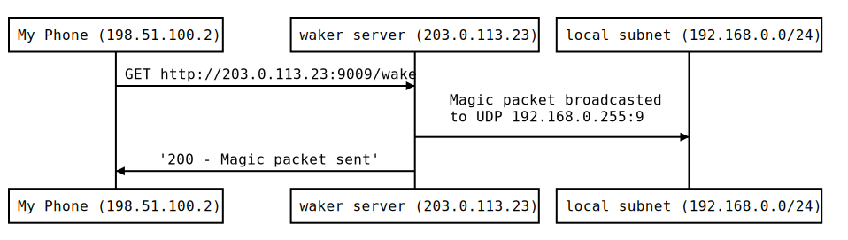

# waker

HTTP interface to send WakeOnLan magic packet remotely

## High level view

The goal of this micro service is to remotely wake a computer from a phone or a laptop.

The **target** is a device that is supposedly expensive to keep running, the **waker server** is a smaller device that can be always on and the **client** is a device that I have at hand (e.g. phone or laptop).

The waker server receives an HTTP request and broadcast the magic packet on the local subnet before sending a confirmation message back to the client.



## Installation

`go install github.com/maxime915/waker@latest`

## Usage

```sh
Usage of waker:
  -address string
    	server binding address (with port) (default ":0")
  -broadcast string
    	UDP address to send the datagram to (with port) (default "192.168.0.255:9")
  -target string
    	6 bytes MAC address of the target
  -verbose
    	gives more network information at start-up
```

A few notes:
- To use the default value for the address, set `-verbose` to see which port is being listened to.
- `broadcast` may be something other than a broadcast address, if that use fits your need
- `target` is mandatory to build the magic packet, no default value can be useful

Access with `GET http://addr:port/wake`, the success message is "200 - Magic packet sent", if any error that couldn't be detected at startup occurs, "500 - Error while sending magic packet" is returned.

To remotely kill the server send `GET http://addr:port/kill`.

## Example

```sh
$ waker -target 00:00:00:00:00:00 -verbose &
[1] 37819
waker is running
	TCP socket [::]:62363
	MAC target 00:00:00:00:00:00
	UDP target 192.168.0.255:9
$ curl "[::]:62363/wake"
200 - Magic packet sent
$ curl "[::]:62363/kill"
[1]  + 37819 done       waker -target 00:00:00:00:00:00 -verbose
```

waker sends the UDP datagram to launch the WakeOnLan procedure on the interface 00:00:00:00:00:00. The datagram is sent on the broadcast address of the local subnet (192.168.0.255:9) by default.

## Building

There are two target: "waker" and "piwaker". The first one is the default for the locall architecture and the second one is targeted towards Raspberry Pi. `make all` builds both version.

made with go1.16

## Example of simple plug&play configuration

If your waker server needs only one instance of `waker` running at once, here is a simple configuration for plug-and-play usage. This supposes the logged-in user is not sudoers and has auto-login. Git and Go must be installed beforehand.

- `go install github.com/maxime915/waker@latest`
- edit `.profile` or equivalent to add

```sh
if ! pidof waker; then
    waker -target 00:00:00:00:00:00 -address 192.168.0.27:9009 2> errs.log &
fi
```
- waker will now start at every login (if no instance is running).